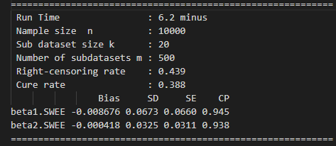
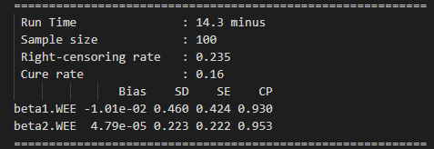

## R code

- WEE.R

  This file provides an example to implement the WEE method.

- SWEE.R

  This file provides an example to implement the SWEE method.
  
  
  
  Before running these codes, the packages "doParallel", "foreach", "survival", "smcure" and "maxLik" should be installed.
  
- Result of an example

  SWEE:

  

  

  MEE:

